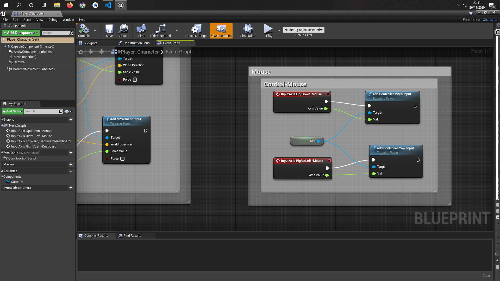

# Apprentissage Unreal engine - basics 

J'ai décidé d'apprendre unreal engine par les blueprint pour me familiarisé avec api unreal engine. Je vais mettre des aperçu de comment faire des mouvements du personnage, mouvement de la caméra..

## pour débuter

- créer une classe (game mode base)
- créer une classe (character)

# mouvements

## initialiser les touches 

-  edit -> project settings > input

## cliquer sur notre classe game mode base

- On arrive sur ce panel on a juste à remplacer notre classe par défaut par notre classe personnage donc ici Player_Character.

## cliquer sur notre classe character

- Add component -> Camera 
- puis placer la caméra assez haute

## Mouvement de la caméra 

- compiler -> fermer la fenêtre -> play (jouer)

## Mouvement du character 

- compiler -> fermer la fenêtre -> play (jouer)